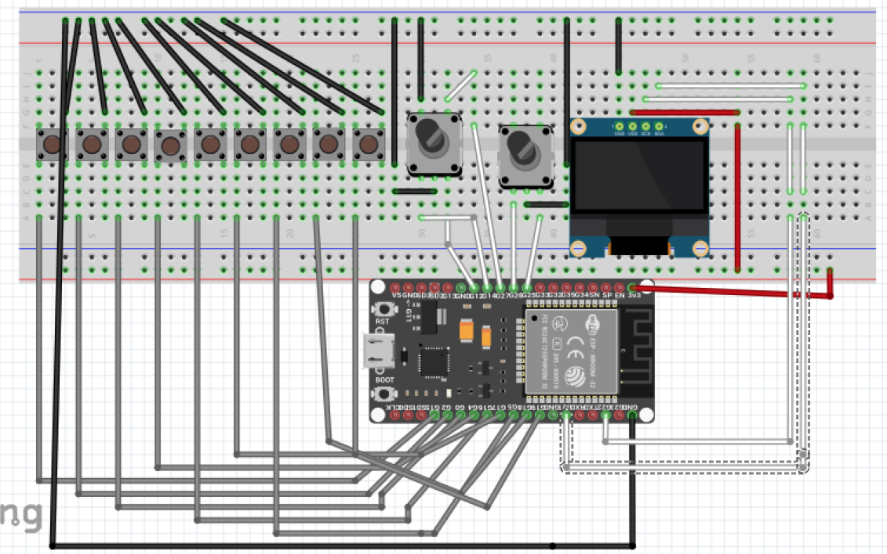

I found myself repeatedly doing the same task, so I devised a solution: building a macro pad to accomplish the task with a single button click.Here are the components that I have used and their purpose of them. If you wish, use the circuit and code to replicate the project at your house.

**Components:**

- ESP32: for the Bluetooth and BLE keypad
- Button: the button that does the job with a single click
- OLED: to display the job done by the button
- rotary encoder: for volume control and layout control

**Circuit:**

1. connect buttons to gnd
2. button 1 to pin 15
3. button 2 to pin 2
4. button 3 to pin 0
5. button 4 to pin 4
6. button 5 to pin 16
7. button 6 to pin 17
8. button 7 to pin 5
9. button 8 to pin 18
10. button 9 to pin 19
11. oled to gnd, vcc , scl to pin 22, sda to pin 21
12. rottery encoder 1 middle pin to gnd, b pin to 12, a pin to 14
13. rottery encoder 2 middle pin to gnd, b pin to 25, a pin to 26

**Code:**
Here is the code for the macro keypad.:

[oled](https://github.com/HavishVivek/projectLab/tree/arduino/sketches/Project/macro)

I had fun building the macro keypad. This was fun expericence. I will being using it in my day to day life.
