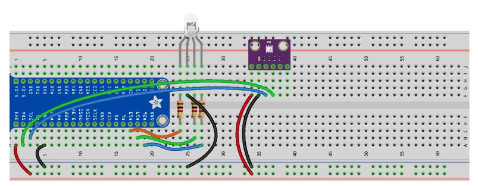

I Was building a project that turn on a fan at a centen temperature. I learned about the temperature sensor and to connect to the raspberrypi I need learn about the I2C protocall.Here are the components that I have used and their purpose of them. If you wish, use the circuit and code to replicate the project at your house.

**Components**

# I2C Communication

1. i2c stands for Inter-Integrated Communication
2. many components can be connected to the i2c to identify the difference but he addresses of the component
3. Some I2c devices can allow to change the address
4. The Raspberry Pi has two pins allocated for i2c which are called SDA and scl
5. The Raspberry Pi needs to enable the i2c to start using the pins
6. after connecting the i2c component to the Raspberry Pi use this i2cdetect command -y 1 to check if a component is connected properly

# BMP280

1. temp sensor has 6 pins but only 4 are used in I2C mode
2. The main command to access the temp sensor is readBME280ALL()
3. temp is given in c and to convert to f is like (temp \* 9/5) + 32

**Circuit**

1. The rgb is connected to 1k ohms resistor and red is connected to pin 13, green to pin 19, and blue to pin 26
2. Pin 1 of temp sensor is connected to vcc Pin 2 to GND Pin 3 to scl Pin 4 to sda

**Code:**

Here is the code for the temp sensor and rgb control.:

[temperature](https://github.com/HavishVivek/projectLab/tree/raspberrypi/Component/lesson%20B-15)
